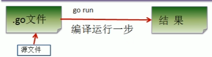
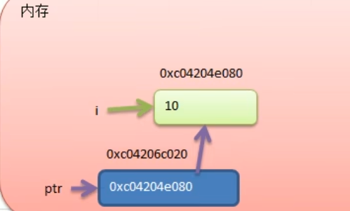
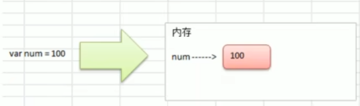
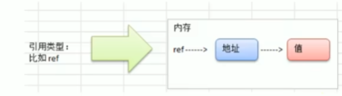
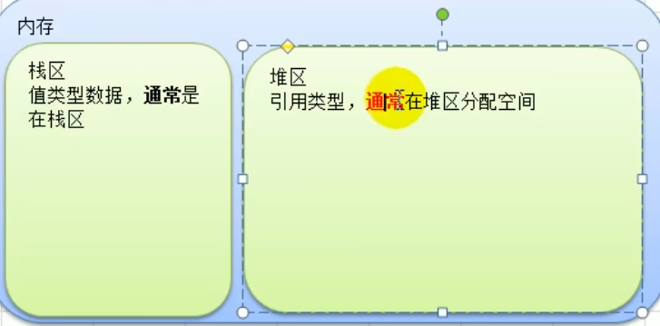

go build  快

go run  慢

区别 先编译成可执行文件的话，可以在没有go环境的机器上执行 这个可执行文件会变大，因为包含了相关资源运行的依赖库文件
go run 需要go环境 否则无法执行

编译：文件到二进制文件

# 指针

值类型
基本数据类型int,float,bool,string,数组，结构体struct

引用类型  
指针，切片，map,管道，interface  

堆区和栈区是一个逻辑概念
